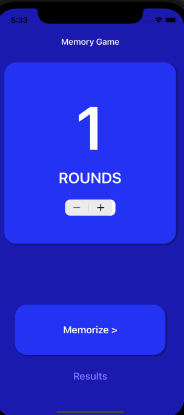
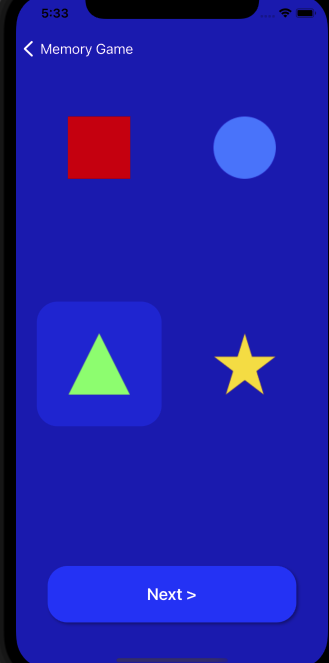

# Shapes

A pattern memorization game that uses shapes to display a pattern and then requires the user to select the order in which the shapes were displayed by the program. At the end, the user can see their score. 

**Preview**

<table>
<tr>
<td width="25%">

Selecting Rounds

</td>
<td width="25%">

Remembering

</td>
<td width="25%">

Results

</tr>
<tr>
<td width="25%">
</img>
</td>
<td width="25%">
</img>
</td>
<td width="25%">
</img>
</td>
</tr>
</table>

## 🌟 Features

- [x] Selecting the amount of rounds you want to play
- [x] Playing the game
- [x] Seeing results

